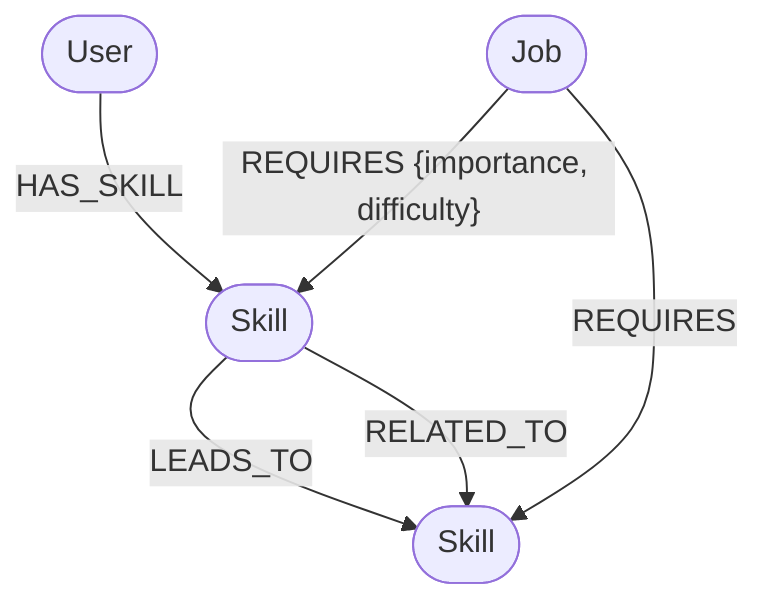

# SkillPath: Career Graph Explorer

SkillPath is a web application backed by a graph database (CognoDB) that helps users understand the gap between their current skills and the requirements of their target jobs.

## Why a Graph Database?

Career paths, skills, and job requirements inherently form a complex network of relationships.
- **Many-to-Many Relationships**: A user has many skills, a job requires many skills, and a skill is required by many jobs.
- **Transitive Relationships**: Skill A leads to Skill B (e.g., JavaScript -> TypeScript). If a job requires TypeScript, a user who only knows JavaScript is closer to that requirement than someone starting from scratch.
- **Relational Drawbacks**: In a traditional SQL database, analyzing skill gaps involves complex, expensive `JOIN` operations across associative tables (`user_skills`, `job_requirements`, `skill_relations`).
- **Graph Advantage**: In a graph database like Neo4j (CognoDB), traversing from a `User` node to a `Job` node through `Skill` relationships is instantaneous and semantically natural. Multi-hop queries to calculate missing skills or match percentages become simple Cypher traversals.

## Data Model



## Setup & Running

### Prerequisites
- Node.js (v18+)
- A CognoDB instance

### 1. Environment Setup
Create a `.env` file in the root directory:
```env
NEO4J_URI=bolt+s://<your-instance-id>.databases.cognodb.cloud
NEO4J_USERNAME=cognodb
NEO4J_PASSWORD=<your-password>
PORT=3001
```

### 2. Install Dependencies
```bash
npm install
```

### 3. Seed the Database
Populates the graph with mock users, skills, jobs, and their relationships:
```bash
npx tsx server/seed.ts
```

### 4. Run the Application
Start the backend API server:
```bash
npx tsx server/index.ts
```

In a new terminal window, start the frontend development server:
```bash
npm run dev
```

## Cypher Queries Explained

### 1. Match Percentage & Skill Gap Analysis (Multi-Hop)
This query calculates how well a user matches a job by counting the required skills they already possess.
```cypher
MATCH (j:Job)-[r:REQUIRES]->(s:Skill)
OPTIONAL MATCH (u:User {id: 'u1'})-[:HAS_SKILL]->(s)
WITH j, count(r) AS totalRequired, count(u) AS matchedSkills
RETURN j, totalRequired, matchedSkills, toInteger((toFloat(matchedSkills) / totalRequired) * 100) AS matchPercentage
ORDER BY matchPercentage DESC
```
**Why it's powerful:** It traverses from `Job` to `Skill` and checks for a reverse connection from `User` to `Skill` in a single pass, avoiding multiple table lookups.

### 2. Inserting Skill Relationships safely (APOC / Fallback)
```cypher
MATCH (source:Skill { id: $sourceId })
MATCH (target:Skill { id: $targetId })
MERGE (source)-[r:LEADS_TO]->(target)
```
Used in our seed script to establish learning paths between technologies.
