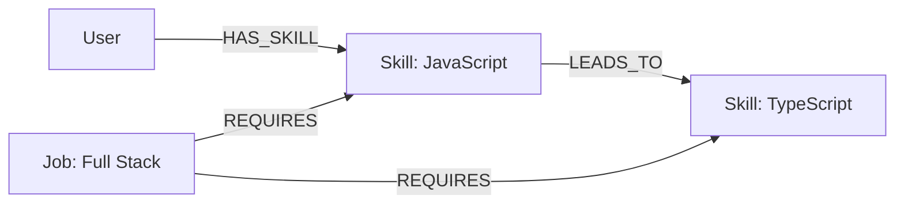

# SkillPath: AI-Powered Career Skill Gap Explorer

SkillPath is a graph-powered application that helps students, developers, and job seekers understand the gap between the skills they currently have and the skills required for a target job.

Unlike traditional SQL-backed applications, SkillPath leverages a **Graph Database** to map complex, multi-hop relationships between users, foundational skills, advanced frameworks, and job roles.

## Why a Graph Database?

In a traditional relational database, calculating a dynamic match percentage based on missing transitive skills requires complex, expensive `JOIN` tables. In SkillPath, the Cypher query language elegantly hops through relationships in a few lines of code to generate real-time match scores and multi-hop "Skill Bridge" recommendations.

### Architecture

```mermaid
graph TD
    UI[React 19 + Tailwind UI] -->|REST API| API[Express API (Vercel Serverless)]
    API -->|Bolt Protocol| Driver[neo4j-driver]
    Driver -->|openCypher| DB[(CognoDB)]
```

### Graph Data Model

The application centers around three node labels (`User`, `Skill`, `Job`) connected by meaningful edges.


*Relationship properties:* `REQUIRES` edges contain `{importance, difficulty, explanation}` to provide rich context on *why* a skill is needed.

---

## Core Graph Queries

The power of CognoDB is demonstrated in three primary Cypher queries used in the application.

### Query 1: Dynamic Match Calculation (N+1 Optimized)
Calculates how many required skills the user possesses out of the total required for every job in a single pass.
```cypher
MATCH (j:Job)-[r:REQUIRES]->(s:Skill)
OPTIONAL MATCH (u:User {id: 'u1'})-[:HAS_SKILL]->(s)
WITH j, count(r) AS totalRequired, count(u) AS matchedSkills, collect({
  skillId: s.id, importance: r.importance, difficulty: r.difficulty, explanation: r.explanation
}) AS requirements
RETURN j, totalRequired, matchedSkills, toInteger((toFloat(matchedSkills) / totalRequired) * 100) AS matchPercentage, requirements
ORDER BY matchPercentage DESC
```

### Query 2: Multi-Hop Skill Bridge Traversal
A genuine `2+ hop` traversal that finds missing skills required for a target job, which are reachable (via `LEADS_TO`) from skills the user *already* knows.
```cypher
MATCH (u:User {id: 'u1'})-[:HAS_SKILL]->(current:Skill)
MATCH (current)-[:LEADS_TO*1..2]->(related:Skill)
MATCH (job:Job {id: $jobId})-[:REQUIRES]->(related)
WHERE NOT (u)-[:HAS_SKILL]->(related)
RETURN DISTINCT current.name AS currentSkill, related.name AS recommendedSkill, job.title AS targetJob
```

### Query 3: Graph Visualization
Fetches the entire context map (excluding isolated nodes) to render the interactive SVG Career Graph.
```cypher
MATCH (n) 
WHERE n:Job OR n:Skill OR n:User
RETURN id(n) AS id, labels(n)[0] AS type, n.name AS name, n.title AS title

MATCH (n)-[r]->(m)
RETURN id(n) AS source, id(m) AS target
```

---

## Setup & Local Development

1. **Install Dependencies**
   ```bash
   npm install
   ```

2. **Environment Variables**
   Create a `.env` file in the root directory with your CognoDB credentials:
   ```env
   NEO4J_URI=bolt+s://your-instance.databases.cognodb.com
   NEO4J_USERNAME=cognodb
   NEO4J_PASSWORD=your_password
   ```

3. **Seed the Database**
   Populate the graph with Jobs, Skills, and Relationships.
   ```bash
   npx tsx server/seed.ts
   ```

4. **Run Locally**
   Start the Vite frontend and Express backend concurrently:
   ```bash
   npm run dev
   # (In a separate terminal)
   npx tsx server/index.ts
   ```

## Live Demo & Screenshots
**Vercel Production Demo**: [https://wexai.vercel.app](https://wexai.vercel.app) *(Replace with your actual URL)*

### Dashboard & Match Scores
*(Add screenshot of Dashboard here)*

### Multi-Hop Skill Bridge
*(Add screenshot of Job Details here)*

### Career Graph Visualization
*(Add screenshot of Career Graph here)*
